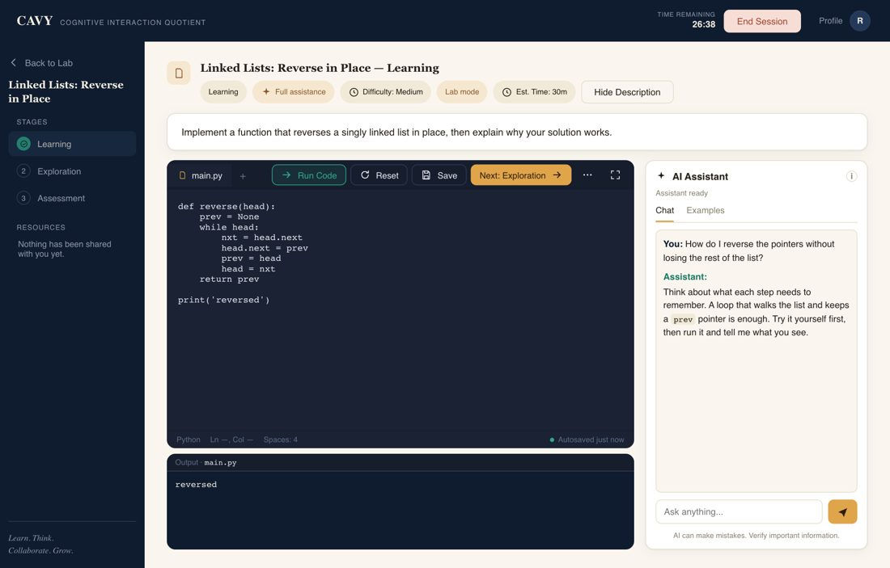
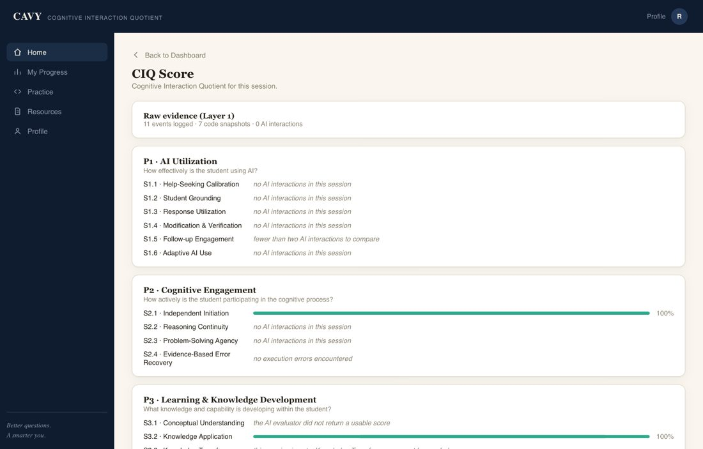
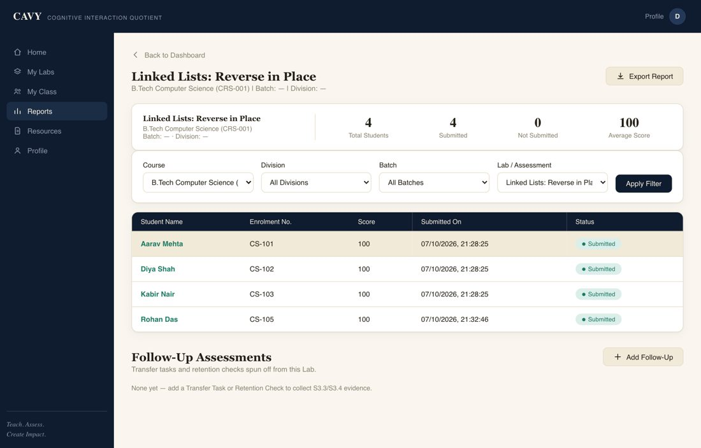
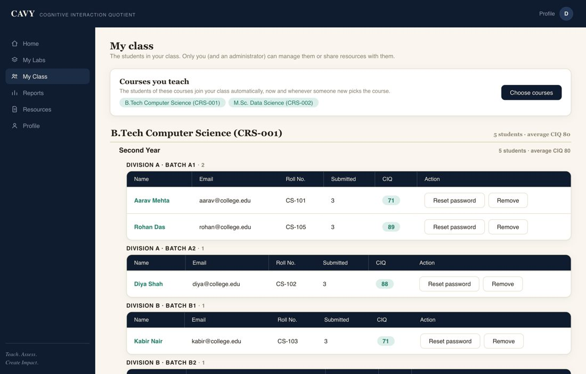
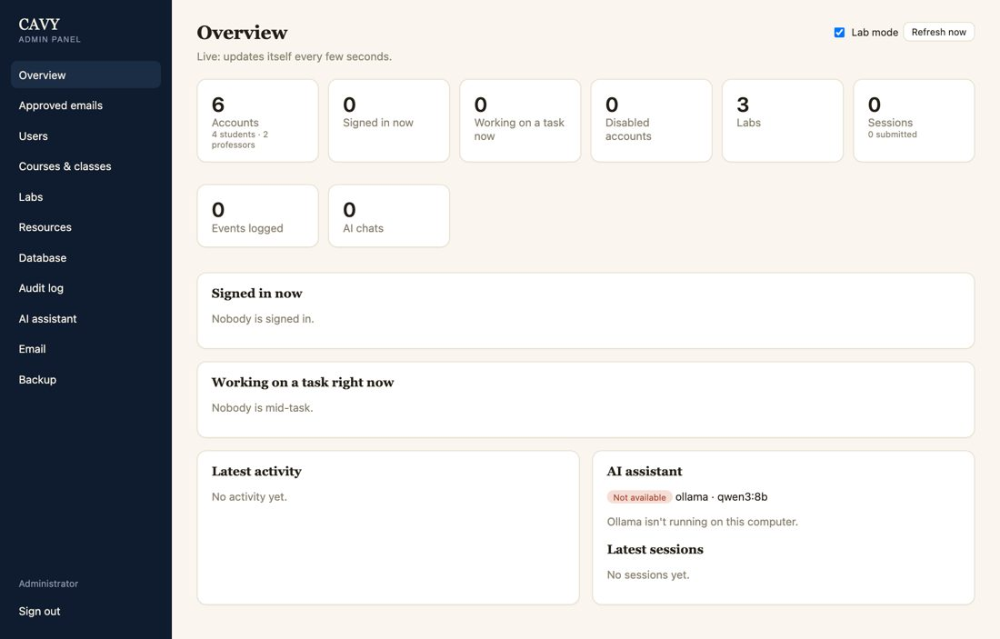

# CAVY: Cognitive Interaction Quotient

> *In the age of AI, we are measuring the answers, but we have stopped measuring the thinker.*

CAVY is a classroom platform for programming education that records **how students work with an AI
assistant**, not only what they hand in, and turns that record into a score: the **Cognitive Interaction
Quotient (CIQ)**. It runs on Windows and macOS, with a shared server for a whole class and a browser
admin panel.

It is a research instrument and a working product at the same time: the research question shaped the
software, and the software exists so the question can be tested on real students.

<p align="center"></p>

| | |
|---|---|
| **Wireframes** | [CAVY Platform Wireframe on Figma](https://www.figma.com/design/1rHhK4KU4ndumQBopIkcT1/CAVY-Platform-Wireframe?node-id=0-1) |
| **Installers** | [Releases](https://github.com/ViralKariya-VK/eaal-platform/releases) (macOS `.dmg`, Windows `.exe`) |
| **Every screen** | [Application walkthrough (PDF)](docs/CAVY-Application-Walkthrough.pdf) |
| **Engineering evidence** | [Software report (PDF)](docs/Audit%20Report.pdf) |
| **Group** | Group 04, NMIMS: Viral Kariya, Vanshika Ahuja, Yashika Parmar, Carol Maria |

## The problem

Students now work with ChatGPT, Claude, Gemini and Copilot every day. In a 2025 UK survey, 88% of
undergraduates had used generative AI for assessments, up from 53% a year earlier (HEPI, 2025), and 84% of
developers use or plan to use AI tools (Stack Overflow, 2025). Yet a lab is still judged by its final code.
Two students can submit the same correct answer, one having reasoned with the AI and the other having pasted
its reply. Existing tools do not tell them apart: AI detectors judge the text, proctoring treats AI as a
violation, coding platforms grade the output, learning-analytics tools count activity, and assistants only
help.

The question has changed from *"Did the student use AI?"* to *"How did the student learn while using AI?"*

## The research idea

CAVY builds on the **AIQ** framework for human-AI collaboration (Ganuthula and Balaraman, 2025) and on the
literature on automation bias and over-reliance (Alon-Barkat and Busuioc, 2023; Klingbeil et al., 2024; Glickman
and Sharot, 2025), and moves the measurement from outcomes to **process**. Students solve labs in an
environment where AI is available but optional; the platform passively logs every prompt, reply, edit, run and
submission as an immutable, timestamped event. The scores are then *pure functions of that event log*, which
makes them reproducible and checkable.

The two preliminary hypotheses we want to test:

1. Users with access to generative AI complete tasks faster but show lower cognitive independence than users
   without it.
2. Feedback on AI reliance changes users' cognitive independence over time.

### What is measured

Fourteen behavioural signals in three pillars. Each signal says *none, and why* when there is not enough
evidence, rather than inventing a number.

| Pillar | Signals |
|---|---|
| **P1 · AI utilization**: how well is AI used? | S1.1 Help-seeking calibration · S1.2 Student grounding · S1.3 Response utilization · S1.4 Modification and verification · S1.5 Follow-up engagement · S1.6 Adaptive AI use |
| **P2 · Cognitive engagement**: how actively does the student think? | S2.1 Independent initiation · S2.2 Reasoning continuity · S2.3 Problem-solving agency · S2.4 Evidence-based error recovery |
| **P3 · Learning and knowledge development**: what is gained? | S3.1 Conceptual understanding · S3.2 Knowledge application · S3.3 Knowledge transfer · S3.4 Retention and recall |

Most signals are deterministic (for example, how much of the student's own work came before the first AI
question, or whether AI-written code was edited and then run). Three (S1.1, S1.2, S3.1) are scored by a language
model against a written rubric. The overall CIQ is a provisional equal-weight average; its weighting is not yet
validated.

### How far the evidence goes

A separate validation suite ([`validation/`](validation/)) checks that the signals compute what they claim:

- 53 of 53 known-answer trials match the value worked out by hand
- 10 of 10 "no evidence" cases return *none*, never a made-up number
- 88 of 88 recomputations of the same session are bit-identical
- the three model-scored signals agree with hand-labelled examples (Spearman r = 0.84 to 0.87)

What this does **not** show is that the signals predict real learning. That needs a study with students, which
is the next step; see [validation/report/VALIDATION_REPORT.pdf](validation/report/VALIDATION_REPORT.pdf) for the
methods and the limits.

## What it looks like

<table>
<tr>
<td width="50%"><br><sub><b>The student sees</b> their CIQ and the evidence behind each signal.</sub></td>
<td width="50%"><br><sub><b>The teacher sees</b> who submitted, scores, and can open any student's real work.</sub></td>
</tr>
<tr>
<td width="50%"><br><sub><b>Classes</b> follow courses, years, divisions and batches; a student can have several professors.</sub></td>
<td width="50%"><br><sub><b>The administrator</b> runs the server from a browser, including the lab-mode switch.</sub></td>
</tr>
</table>

The screens above use demonstration data. The full set is in the
[walkthrough](docs/CAVY-Application-Walkthrough.pdf), and the design started as the
[Figma wireframes](https://www.figma.com/design/1rHhK4KU4ndumQBopIkcT1/CAVY-Platform-Wireframe?node-id=0-1).

## What the platform does

- **Labs.** A professor creates a lab with three stages (Learning, Exploration, Assessment), each with its own
  AI-assistance level, aimed at a course, year, division and batch. Students work through the stages in one
  coding screen (Back and Next), explain their solution in their own words, and submit once. Practice mode is
  separate and ungraded.
- **Lab mode.** The lab opens full screen, switching apps is blocked where the operating system allows it,
  leaving the window twice submits the lab, and pasted text is recorded and compared with what the AI wrote.
  The administrator can switch it off.
- **People and classes.** Only approved emails can sign up. Courses have an ID, a level, a department and years.
  Professors choose the courses they teach, and every student of a course joins the class of each professor who
  teaches it. First logins and password resets arrive by email.
- **AI, your choice.** A local model (Ollama) works offline; hosted providers (OpenAI, Claude, Gemini, Grok,
  Groq) work with a key. A student's own key stays in that computer's memory and is never sent to the server.
- **One shared server.** A professor and many students on one network share live data. The same `CavyApi`
  class serves the desktop app, the server and the tests.
- **Installers** for macOS and Windows, built and smoke-tested by GitHub Actions.

## Get it

**Just use it.** Download the installer for your system from [Releases](https://github.com/ViralKariya-VK/eaal-platform/releases).
The installers are not yet code-signed, so macOS and Windows will warn the first time; the release notes say how
to open them. For a classroom, one computer runs the server and the others type its address; see
[docs/DEMO_SETUP.md](docs/DEMO_SETUP.md).

**Run it from source.**

```bash
conda create -n eaal-platform python=3.11
conda activate eaal-platform
python -m pip install -r requirements.lock      # the exact versions the tests run against
python -m pip install -e . --no-deps
python -m eaal_platform.app                      # the desktop app
python -m eaal_platform.server                   # the classroom server (admin panel at /admin)
```

Ollama is needed for the local assistant (`ollama serve`, then `ollama pull qwen3:8b`). The Monaco editor is
fetched with `python scripts/fetch_monaco.py` (the app falls back to a plain text box without it). The first
administrator password is created with `get-admin-password.command` (macOS) or `get-admin-password.bat`
(Windows), or `python -m eaal_platform.server --reset-admin-password`.

## How it is built

Python backend, web front end, one native window. [pywebview](https://pywebview.flowrl.com/) shows the HTML
front end in the system's web view and exposes a single Python object, `CavyApi`, to its JavaScript. FastAPI
serves the classroom server and admin panel; SQLite (WAL) with SQLAlchemy 2 stores an append-only event log.

```
src/eaal_platform/
  api/       CavyApi: the one bridge every screen talks to
  client/    the app's side: local data or a server, lab-mode lock-down
  server/    FastAPI classroom server, email onboarding, the admin panel (admin_ui/)
  db/        models, engine, accounts, courses, resources, approvals
  signals/   the 14 CIQ signals, computed from the event log
  events/    background, batched event logger
  sandbox/   student code runs in a separate process with a time limit
  ai/        provider interface; Ollama and hosted providers
  web/       the front end (no build step)
validation/  research: validation of the signals
pilot_web/   research: the small web survey used for the pilot
packaging/   PyInstaller, Inno Setup and dmg recipes
```

Why these choices (and the alternatives we weighed) are in the [software report](docs/Audit%20Report.pdf).

## Evidence that it works

| | |
|---|---|
| Tests | 457 passing, 89% line and branch coverage (floor 70%) |
| Static checks | Ruff 0 issues, mypy strict 0 errors, Bandit 0 findings, pip-audit clean on 151 pinned packages |
| Complexity | average grade A (3.2); no block above 13 |
| Mutation testing | 83% of mutants killed on the scoring engine |
| Speed | 30 students at once: about 800 calls a second, none failed; 100 students: none failed ([details](docs/PERFORMANCE.md)) |

```bash
ruff check . && ruff format --check .
mypy src
pytest                      # with the coverage gate
radon cc src -s -n C        # complexity
python scripts/benchmark.py --students 30
python scripts/make_audit_report.py   # regenerates the software report
```

`pre-commit install` runs Ruff, mypy and a fast test subset on every commit.

## Honest limits

- Traffic on the classroom network is plain HTTP; the installers are not code-signed.
- `api/bridge.py` is one very large class and is the first thing to split.
- Lab mode cannot block every operating-system escape (for example Ctrl+Alt+Del), and it has been checked most
  on macOS; Windows needs more real-machine testing ([docs/WINDOWS_TESTING.md](docs/WINDOWS_TESTING.md)).
- The signals are validated for correctness and repeatability on constructed cases, not yet against real
  learning outcomes, and the CIQ weighting is provisional.
- The weakest of the three model-scored signals, S3.1, once gave full marks to a line-by-line restatement of the
  code; this is reported rather than hidden.

## Where this goes next

A pilot in one real class (survey of students and professors, real event data), HTTPS and signed installers,
splitting the bridge module, learning-system (LMS) integration, validating the signals against outcomes, and
adaptive AI assistance that tightens or loosens help according to how a student is doing. See
[docs/ROADMAP.md](docs/ROADMAP.md).

## References

- Ganuthula, V. R. R., and Balaraman, K. K. (2025). Artificial intelligence quotient framework for measuring human
  collaboration with artificial intelligence. *Discover Artificial Intelligence, 5*, 268.
- Klingbeil, A., Grützner, C., and Schreck, P. (2024). Trust and reliance on AI: an experimental study on the extent
  and costs of over-reliance on AI. *Computers in Human Behavior, 160*, 108352.
- Alon-Barkat, S., and Busuioc, M. (2023). Human-AI interactions in public sector decision making: "automation bias"
  and "selective adherence" to algorithmic advice. *Journal of Public Administration Research and Theory.*
- Glickman, M., and Sharot, T. (2025). How human-AI feedback loops alter human perceptual, emotional and social
  judgements. *Nature Human Behaviour, 9*(2), 345-359.
- Zheng, J., et al. (2025). Do students rely on AI? Analysis of student-ChatGPT conversations from a field study.
- Higher Education Policy Institute (2025). *Student Generative AI Survey 2025.*
- Stack Overflow (2025). *Developer Survey 2025.*
