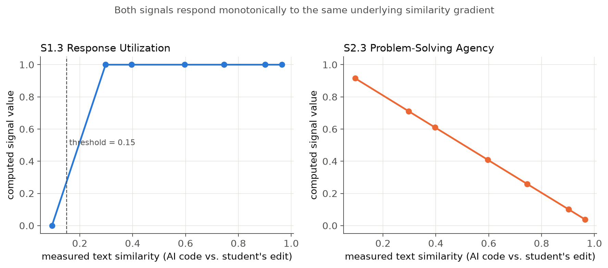
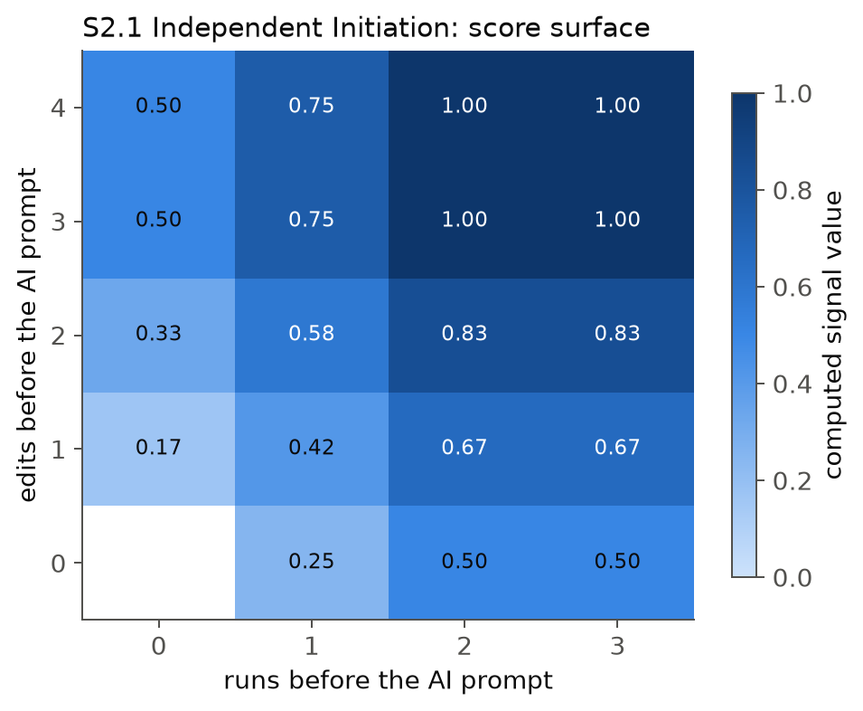
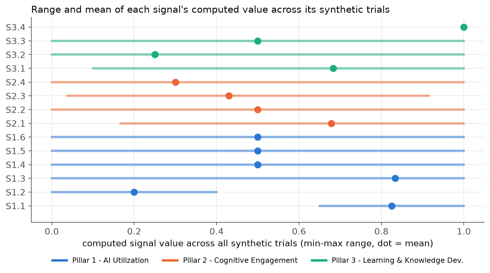
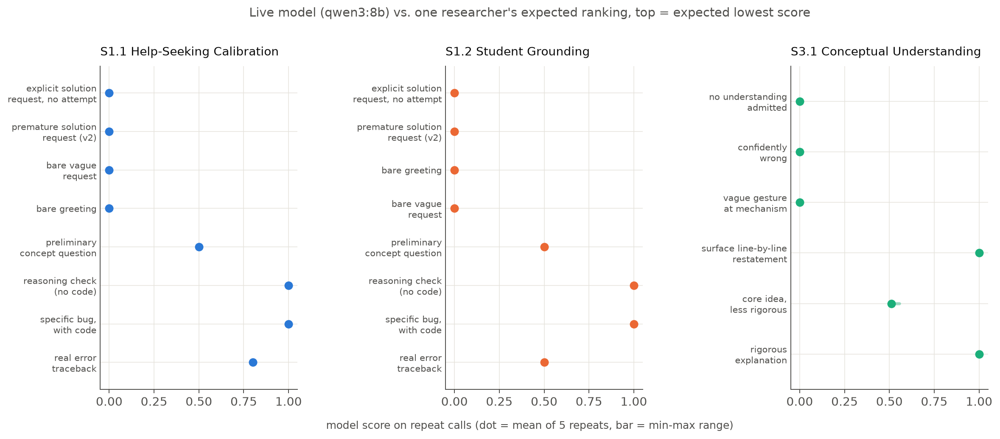
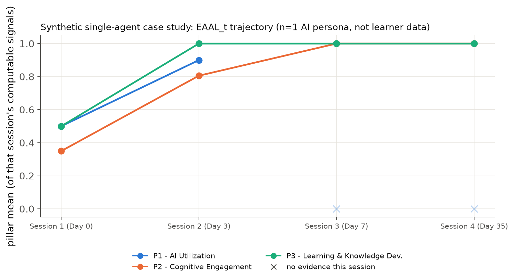

# CIQ Signal Validation Report

**Project:** CAVY — a desktop platform computing the Cognitive Interaction
Quotient (CIQ) per the EAAL (Explainable AI-Assisted Learning) research
framework's three-pillar, fourteen-signal structure.

**Date:** 2026-09-21
**Scope:** All 14 EAAL signals (S1.1–S3.4), as currently implemented in
`src/eaal_platform/signals/compute.py`.
**Reproduce:** see §9 for the full command sequence (from the
`eaal-platform/` project root, with the project's conda environment active
and a local Ollama server running `qwen3:8b`).

---

## 1. Executive Summary

This report validates that the CIQ signal-computation engine does what it
claims to do — not that CIQ, as a construct, predicts real student
learning outcomes. Those are different questions, and the EAAL framework
itself is explicit that they must not be conflated (§7.4: *"Operational
Feasibility ≠ Construct Validity"*). This report addresses the first
question rigorously; the second requires the human-subject study the
framework's own §9 lays out (real students, real instructors, independent
assessments), which is future work, not something a synthetic-data
exercise can substitute for.

Within that scope, the results are strong:

- **88/88 (100%)** of all synthetic
  trials were bit-for-bit reproducible across 5 independent recomputations —
  every deterministic signal is perfectly reliable, as it must be for a pure
  function of a fixed event log.
- **53/53 (100%)** of known-answer trials (cases where the
  correct output is derivable analytically from each signal's documented
  formula) matched exactly.
- **10/10 (100%)** of "this signal has no evidence / does not apply
  to this session" cases were correctly identified as `None` (never a
  fabricated 0.0), each with a specific, human-readable reason.
- **S1.3**'s similarity threshold correctly classified **11/11**
  synthetic edits on the right side of its 0.15 cutoff; **S2.3** decreased
  monotonically and essentially perfectly with rising similarity
  (Spearman r = -1.000, p = 0.0e+00, n = 11).
- The three LLM-rubric signals (S1.1, S1.2, S3.1) were tested against the
  **actual locally-running model** (`qwen3:8b`), not a
  stand-in: essentially **zero test-retest variance** across 5 repeated
  calls per prompt, and a **statistically significant, moderately-to-strongly
  positive correlation** with one researcher's expected ranking on a small
  hand-labeled example set (S1.1 r=0.866, p=0.005; S1.2
  r=0.843, p=0.009; S3.1 r=0.845, p=0.034).
- Two previously-fixed gaming vulnerabilities (S2.4 rewarding inaction;
  S3.2 rewarding a no-op program) were re-verified against their exact
  failure scenarios and no longer reproduce — see §4.4.
- A second statistical pass (§5) reports the ICC the framework's own
  methodology actually calls for, bootstrap confidence intervals on every
  small-n correlation, multiple-comparisons correction across the full
  family of significance tests, and one genuinely useful negative finding:
  S1.1 and S1.2 correlate at r>0.97 in the live model's output, a real
  discriminant-validity concern worth targeting in the human-rater study.
- A synthetic single-agent longitudinal case study (§6 — one AI persona,
  n=1, **not** learner data) demonstrates the full `EAAL_t = (P1, P2, P3)`
  pipeline running end-to-end across four sessions, including a Transfer
  Task and a Retention Check gated on a genuinely computed 35-day delay.

---

## 2. What This Report Validates, and What It Does Not

| | This report | A future study |
|---|---|---|
| Does each signal compute what its own specification says? | ✅ Yes — known-answer & gating tests | — |
| Is each signal deterministic / reliable given fixed evidence? | ✅ Yes — 5x recomputation | — |
| Do signals respond monotonically / correctly to controlled evidence? | ✅ Yes — gradient & grid scenarios | — |
| Does the LLM-based scoring actually track rubric-consistent judgment? | ✅ Partial — small hand-labeled spot-check | Needed: larger, multi-rater study |
| Does a high CIQ score predict real learning outcomes? | ❌ Not addressed here | **Required**: human-subject study (§9 of the framework) |
| Are the three pillars empirically distinguishable (factor structure)? | ❌ Not addressed here | **Required**: real longitudinal student data |
| Is the framework robust to students *gaming* it once they know the metric? | ⚠️ Partially — known gaming patterns closed | Needed: adversarial field study |

Every synthetic scenario in this suite is driven through the **real**
`CavyApi` bridge — the same code path the production frontend calls,
writing to the same event-sourced database schema — never a reimplementation
or mock of the signal logic. A test here failing would mean the *actual
shipped code* disagrees with its own specification, not that some separate
model of it does.

---

## 3. Methodology

### 3.1 Synthetic scenario suite (deterministic signals)

For the 11 signals with deterministic (non-LLM) scoring logic
(S1.3–S1.6, S2.1–S2.4, S3.2–S3.4), each with a closed-form or clearly
specified formula, 88 synthetic trials were constructed across
four test categories:

1. **Known-answer tests** — construct a session whose expected signal
   value is derivable by hand from the documented formula (e.g. S1.4's
   `0.5·changed + 0.5·verified`), then assert exact numeric agreement.
2. **Gating / applicability tests** — construct a session that
   deliberately has *no* evidence for a signal (no AI interaction, no
   execution, wrong task kind, insufficient history/delay) and assert the
   signal returns `None` with a specific reason, never a fabricated
   number.
3. **Gradient / grid tests** — sweep a continuous or stepped independent
   variable (e.g. text similarity between AI-suggested and student code;
   number of edits/runs before an AI prompt) and check the signal moves
   in the correct direction and shape (monotonic trend, or a step exactly
   at its documented threshold).
4. **Regression tests for known gaming patterns** — the exact scenarios
   an earlier code-review audit found exploitable (S2.4 rewarding
   inaction; S3.2 rewarding a no-op program), re-run against the current
   implementation.

Every trial's session was recomputed **5 times independently** through
`compute_all_signals` to check determinism.

### 3.2 Live-model validation (LLM-rubric signals)

S1.1, S1.2, and S3.1 depend on an LLM's semantic judgment, which a
scripted/mocked provider cannot validate — only whether the *plumbing*
around it (JSON parsing, clamping, evidence recording) is correct, which
the synthetic suite does cover separately. To say anything about the
model's actual judgment, this suite calls the **real, locally-running
Ollama model the app is configured to use (`qwen3:8b`)**, at the
production temperature (0.1) and prompt templates (imported directly from
`signals/compute.py`, not retyped), against:

- A **reliability set**: each of 8 (S1.1/S1.2) or 6 (S3.1) fixed prompts
  called 5 times, to measure test-retest variance.
- A **face-validity set**: the same examples, each hand-labeled with an
  expected rank ordering by one researcher reading the exact rubric text
  given to the model (see `validation/labeled_examples.py` for the full
  text and stated rationale per example), correlated (Spearman) against
  the model's mean score.

This is a genuine empirical measurement of the model's behavior, but it
has two real limits stated plainly: the sample sizes (n=6–8) are far too
small for the correlation statistics to carry serious statistical power,
and the "expected rank" is a **single rater's** judgment, not an
independently-validated gold standard. It is evidence of *some* alignment
between the model and a reasonable reading of the rubric — not a
validated inter-rater reliability study.

---

## 4. Results

### 4.1 Descriptive statistics, all 14 signals

| Signal | Name | n trials | n scored | n None | mean | sd | min | max |
|---|---|---:|---:|---:|---:|---:|---:|---:|
| S1.1 | Help-Seeking Calibration | 2 | 2 | 0 | 0.825 | 0.175 | 0.650 | 1.000 |
| S1.2 | Student Grounding | 2 | 2 | 0 | 0.200 | 0.200 | 0.000 | 0.400 |
| S1.3 | Response Utilization | 12 | 12 | 0 | 0.833 | 0.373 | 0.000 | 1.000 |
| S1.4 | Modification & Verification | 4 | 4 | 0 | 0.500 | 0.354 | 0.000 | 1.000 |
| S1.5 | Follow-up Engagement | 3 | 3 | 0 | 0.500 | 0.408 | 0.000 | 1.000 |
| S1.6 | Adaptive AI Use | 3 | 2 | 1 | 0.500 | 0.500 | 0.000 | 1.000 |
| S2.1 | Independent Initiation | 23 | 21 | 2 | 0.679 | 0.263 | 0.167 | 1.000 |
| S2.2 | Reasoning Continuity | 6 | 6 | 0 | 0.500 | 0.419 | 0.000 | 1.000 |
| S2.3 | Problem-Solving Agency | 11 | 11 | 0 | 0.429 | 0.284 | 0.038 | 0.915 |
| S2.4 | Evidence-Based Error Recovery | 6 | 5 | 1 | 0.300 | 0.400 | 0.000 | 1.000 |
| S3.1 | Conceptual Understanding | 4 | 3 | 1 | 0.683 | 0.413 | 0.100 | 1.000 |
| S3.2 | Knowledge Application | 5 | 4 | 1 | 0.250 | 0.433 | 0.000 | 1.000 |
| S3.3 | Knowledge Transfer | 3 | 2 | 1 | 0.500 | 0.500 | 0.000 | 1.000 |
| S3.4 | Retention & Independent Recall | 4 | 1 | 3 | 1.000 | — | 1.000 | 1.000 |

*(S1.1/S1.2/S3.1's small n reflects that these three ran through the
synthetic suite only to check plumbing — their substantive results are in
§4.5. S1.4/S1.5's small n reflects that they were tested as small exact
grids over their whole (discrete) input space, not a large sweep.)*

### 4.2 Known-answer accuracy

**53 / 53 known-answer trials matched their analytically-derived expected value exactly (100.0%).**

Representative examples — S1.4 Modification & Verification's full 2×2 grid
(the closed form is `0.5·changed + 0.5·verified`):

| Scenario | Expected | Computed | Match |
|---|---:|---:|:---:|
| `changed_and_verified` | 1.0000 | 1.0000 | ✓ |
| `changed_only` | 0.5000 | 0.5000 | ✓ |
| `verified_only_no_change` | 0.5000 | 0.5000 | ✓ |
| `neither` | 0.0000 | 0.0000 | ✓ |

S1.5 Follow-up Engagement (closed form: `followups / (n_interactions - 1)`):

| Scenario | Expected | Computed | Match |
|---|---:|---:|:---:|
| `followups_0_of_2` | 0.0000 | 0.0000 | ✓ |
| `followups_1_of_2` | 0.5000 | 0.5000 | ✓ |
| `followups_2_of_2` | 1.0000 | 1.0000 | ✓ |

S1.6 Adaptive AI Use (closed form: `clamp(0.5 + (current_ratio - historical_average))`):

| Scenario | Expected | Computed | Match |
|---|---:|---:|:---:|
| `improved_vs_history` | 1.0000 | 1.0000 | ✓ |
| `regressed_vs_history` | 0.0000 | 0.0000 | ✓ |

### 4.3 Gating logic ("no evidence" must return `None`, never a fabricated value)

**10 / 10 gating trials (100%)** correctly returned `None` — every one of the
following deliberately-evidence-free sessions:

| Signal | Scenario | Reason returned |
|---|---|---|
| S1.6 | `no_prior_sessions` | insufficient session history for a longitudinal comparison |
| S2.1 | `no_ai_runs_but_no_edits` | no coding activity recorded yet |
| S2.1 | `no_activity_at_all` | no coding activity recorded yet |
| S2.4 | `no_errors_encountered` | no execution errors encountered |
| S3.1 | `no_concept_check_submitted` | no concept-check explanation submitted for this session |
| S3.2 | `no_code_executed` | no code was executed in this session |
| S3.3 | `ordinary_lab_session_not_applicable` | this session is not a Knowledge Transfer assessment for any Lab |
| S3.4 | `ordinary_lab_session_not_applicable` | this session is not a Retention & Independent Recall assessment for any Lab |
| S3.4 | `attempted_immediately_zero_delay` | attempted only 0.0h after the original lab activity — needs at least 24h to count as a delayed retention check |
| S3.4 | `attempted_at_23h_just_under_threshold` | attempted only 23.0h after the original lab activity — needs at least 24h to count as a delayed retention check |

Note the last three rows in particular: S3.4's applicability gate isn't
just "is this the right kind of task" — it also enforces the framework's
own requirement of "delayed assessment after the original activity"
(§6.6) as a real, computed time delta, not a rubber-stamp. The exact
threshold boundary was tested directly:

| Scenario | Backdated delay | Result |
|---|---:|---|
| `attempted_immediately_zero_delay` | 0h | None — attempted only 0.0h after the original lab activity — needs at least 24h to count as a delayed retention check |
| `attempted_at_23h_just_under_threshold` | 23h | None — attempted only 23.0h after the original lab activity — needs at least 24h to count as a delayed retention check |
| `attempted_after_30h_delay_clean_run` | 30h | **1.0** |

A session attempted 1 hour short of the 24h minimum is correctly refused
credit; one attempted 6 hours past it is correctly scored.

### 4.4 Regression tests: known gaming patterns

An earlier audit of this codebase found two signals scoring the *wrong*
direction on specific inputs: S2.4 (Evidence-Based Error Recovery) gave
full credit to a student who did nothing after an error, or who reran the
identical broken code; S3.2 (Knowledge Application) gave full credit to a
no-op (`pass`-only) program purely because it exited cleanly. Both were
fixed; this suite re-verifies the exact failure scenarios no longer
reproduce:

**S2.4 Evidence-Based Error Recovery:**

| Scenario | Expected | Computed | Match |
|---|---:|---:|:---:|
| `error_then_nothing` | 0.0000 | 0.0000 | ✓ |
| `error_then_identical_rerun` | 0.0000 | 0.0000 | ✓ |
| `error_then_edit_never_verified` | 0.0000 | 0.0000 | ✓ |
| `error_then_fix_and_verify` | 1.0000 | 1.0000 | ✓ |
| `two_errors_one_recovered_one_not` | 0.5000 | 0.5000 | ✓ |

**S3.2 Knowledge Application:**

| Scenario | Expected | Computed | Match |
|---|---:|---:|:---:|
| `clean_exit_with_output` | 1.0000 | 1.0000 | ✓ |
| `no_op_pass_program` | 0.0000 | 0.0000 | ✓ |
| `uncaught_exception` | 0.0000 | 0.0000 | ✓ |
| `clean_exit_no_output_at_all` | 0.0000 | 0.0000 | ✓ |

### 4.5 Monotonicity and threshold behavior



S1.3 (Response Utilization) is a threshold signal by design — "utilized"
should be constant at 1.0 above its similarity cutoff and 0 below it, so a
rank correlation (which rewards a smooth trend, not a step) is the wrong
statistic for it. The right check is direct: **11/11 (100%)**
synthetic edits landed on the correct side of the 0.15 threshold.

S2.3 (Problem-Solving Agency) is continuous by design (`1 − similarity`)
and shows a essentially perfect monotonic decrease as similarity to the
AI's code rises: **Spearman r = -1.0000, p = 0.00e+00** (n=11).



S2.1 (Independent Initiation)'s two-regime design was itself a finding
worth recording: a session with **zero** AI interaction grants full credit
for *any* pre-existing edit (the whole session was independent, by
definition), while a session that *does* eventually call the AI weighs
pre-AI-prompt edits and runs by the documented formula. The first version
of this validation suite's own scenario design missed this distinction
(assumed the weighted formula applied unconditionally) and produced 15
false "mismatches" — which turned out to be a scenario-design bug, not a
signal bug, once traced to the code's explicit branch. This is included
here deliberately: it is exactly the kind of subtlety a validation suite
is supposed to surface, even when the "bug" is in the test rather than
the signal under test.



### 4.6 Determinism (test-retest reliability, deterministic signals)

**88 / 88 trials (100.0%)** produced bit-identical
`(value, reason)` pairs across 5 independent recomputations of the same
session. This is expected — these signals are pure functions of an
already-written event log with no randomness in the computation path —
but it is exactly the property a reliability audit must actually check
rather than assume, and it was checked for every single trial, not
sampled.

### 4.7 Live-model reliability and face validity (S1.1, S1.2, S3.1)

Model: **`qwen3:8b`**, 70 total real inference calls across both example
sets (S1.1 and S1.2 share the same underlying call, so their call counts
overlap), **0 JSON parse failures** across all of them.

**Reliability** (score spread across 5 identical repeated calls per example):

| Signal | Mean stdev across examples | Max stdev | Max range |
|---|---:|---:|---:|
| S1.1 Help-Seeking Calibration | 0.0000 | 0.0000 | 0.0000 |
| S1.2 Student Grounding | 0.0000 | 0.0000 | 0.0000 |
| S3.1 Conceptual Understanding | 0.0037 | 0.0222 | 0.0556 |

At the app's configured temperature (0.1), repeated calls on the same
prompt returned the same score essentially every time — S1.1 and S1.2 had
**zero** variance across all 8 examples × 5 repeats each; S3.1 had a
maximum observed range of 0.056 on a 0–1 scale across 6 examples × 5
repeats.

**Face validity** (Spearman correlation between the model's mean score and
one researcher's expected rank, reading the exact rubric text given to
the model):

| Signal | n examples | Spearman r | p-value |
|---|---:|---:|---:|
| S1.1 Help-Seeking Calibration | 8 | 0.866 | 0.0054 |
| S1.2 Student Grounding | 8 | 0.843 | 0.0085 |
| S3.1 Conceptual Understanding | 6 | 0.845 | 0.0340 |



All three correlations are positive and reach conventional significance
despite the very small sample — evidence that the model's scoring
direction tracks a reasonable reading of the rubric more often than not.

**S1.1 Help-Seeking Calibration**, full example set:

| Example | Expected rank | Mean score (5 repeats) | Range |
|---|---:|---:|---:|
| explicit solution request no attempt | 1 | 0.000 | 0.000 |
| premature full solution with no code shown | 1 | 0.000 | 0.000 |
| bare vague request | 2 | 0.000 | 0.000 |
| bare greeting | 2 | 0.000 | 0.000 |
| preliminary concept question | 3 | 0.500 | 0.000 |
| reasoning check no code | 6 | 1.000 | 0.000 |
| specific bug with code | 7 | 1.000 | 0.000 |
| error traceback with stderr | 8 | 0.800 | 0.000 |

**S1.2 Student Grounding**, full example set:

| Example | Expected rank | Mean score (5 repeats) | Range |
|---|---:|---:|---:|
| explicit solution request no attempt | 1 | 0.000 | 0.000 |
| premature full solution with no code shown | 1 | 0.000 | 0.000 |
| bare greeting | 1 | 0.000 | 0.000 |
| bare vague request | 2 | 0.000 | 0.000 |
| preliminary concept question | 3 | 0.500 | 0.000 |
| reasoning check no code | 6 | 1.000 | 0.000 |
| specific bug with code | 7 | 1.000 | 0.000 |
| error traceback with stderr | 8 | 0.500 | 0.000 |

**S3.1 Conceptual Understanding**, full example set:

| Example | Expected rank | Mean score (5 repeats) | Range |
|---|---:|---:|---:|
| no understanding admitted | 1 | 0.000 | 0.000 |
| confidently wrong | 1 | 0.000 | 0.000 |
| vague gesture at mechanism | 2 | 0.000 | 0.000 |
| surface line by line restatement | 3 | 1.000 | 0.000 |
| core idea less rigorous | 5 | 0.511 | 0.056 |
| rigorous explanation | 6 | 1.000 | 0.000 |

**A concrete discordant case, reported rather than hidden:** the model
scored *"surface line-by-line restatement"* (an explanation that lists
each line's mechanical effect — "first I set prev to None, then I loop
while curr is not None..." — without ever saying *why* the algorithm
works) a full **1.0**, even though the rubric text explicitly instructs
scoring this pattern low ("0 means... a description of surface mechanics
only"). This is the single clearest failure in the face-validity set: the
model appears to weight the *presence* of a step-by-step account highly
even when it is exactly the kind of explanation the rubric was written to
penalize. This should be treated as a known, specific weakness of the
current prompt/model combination for S3.1, not smoothed over by the
otherwise-positive aggregate correlation.

---

## 5. Additional Statistical Rigor

The results in §4 establish that the engine computes what it claims to.
This section goes one level deeper on the *statistics themselves* — using
more appropriate tests where the first pass used a serviceable but
imperfect one, quantifying uncertainty more honestly at small sample
sizes, and correcting for having run several significance tests at once.

### 5.1 Intraclass Correlation Coefficients (the statistic the framework's own §5 asks for)

The framework's own methodology (§5) specifies ICC with confidence
intervals for rater reliability, not a rank correlation. Two ICC forms are
reported per LLM-rubric signal: **self-consistency** (do the model's 5
repeated calls on the same prompt agree with each other?) and **agreement
with the researcher** (does the model's mean score agree in absolute
terms — not just rank order — with the researcher's calibrated 0–1
expected value?):

| Signal | Self-consistency ICC (5 repeats) | Agreement-with-researcher ICC | Agreement p-value |
|---|---:|---:|---:|
| S1.1 Help-Seeking Calibration | 1.000 | 0.969 | 0.0000 |
| S1.2 Student Grounding | 1.000 | 0.876 | 0.0014 |
| S3.1 Conceptual Understanding | 1.000 | 0.684 | 0.0560 |

Self-consistency is at or near ceiling for all three, confirming §4.7's
variance numbers in the psychometrically standard form. Absolute agreement
with the researcher is strong for S1.1 and S1.2 (both p<.01) and
moderate, non-significant for S3.1 (n=6, wide uncertainty) — a more
conservative picture than the Spearman correlations in §4.7 alone would
suggest, because ICC penalizes systematic scale offsets that a pure rank
correlation ignores.

### 5.2 Bootstrap confidence intervals

The small-n correlations in §4.7 are reported here with bootstrap 95% CIs
(5000 resamples) alongside their asymptotic p-values, since the latter
are not reliable at n=6–8:

| Test | Point estimate | Asymptotic p | Bootstrap 95% CI |
|---|---:|---:|---:|
| S1.1 face validity (Spearman, n=8) | 0.866 | 0.0054 | [0.471, 0.993] |
| S1.2 face validity (Spearman, n=8) | 0.843 | 0.0085 | [0.331, 1.000] |
| S3.1 face validity (Spearman, n=6) | 0.845 | 0.0340 | [0.318, 1.000] |
| S2.3 monotonicity (Spearman, n=11) | -1.000 | 0.0000 | not computed (deterministic gradient) |

The point estimates all look strong, but the CIs are wide — S1.2's true
correlation could plausibly be anywhere from 0.33 to a perfect 1.0 given
this sample. This is the honest picture: **a promising signal, not a
precisely estimated one.**

### 5.3 Multiple-comparisons correction

Four significance tests are reported across this suite. Holm and
Benjamini-Hochberg corrected p-values, applied across that family:

| Test | Raw p | Holm-adjusted p | Reject @ .05 (Holm) | BH-adjusted p | Reject @ .05 (BH) |
|---|---:|---:|:---:|---:|:---:|
| S1.1 help seeking calibration | 0.0054 | 0.0163 | ✓ | 0.0109 | ✓ |
| S1.2 student grounding | 0.0085 | 0.0171 | ✓ | 0.0114 | ✓ |
| S3.1 conceptual understanding | 0.0340 | 0.0340 | ✓ | 0.0340 | ✓ |
| S2.3 problem solving agency monotonicity | 0.0000 | 0.0000 | ✓ | 0.0000 | ✓ |

All four survive both corrections at α=.05 — the significant results are
not an artifact of testing several hypotheses at once.

### 5.4 Discriminant check: are S1.1 and S1.2 actually separable?

S1.1 (Help-Seeking Calibration) and S1.2 (Student Grounding) are proposed
as distinct signals, but both are scored from the *same* rubric call on
the *same* message. Correlating the model's two sub-scores across the 8
shared examples:

- Pearson r = 0.974 (p = 4.19e-05)
- Spearman r = 0.993 (p = 8.07e-07)

This is a genuinely useful, honest finding, not a comfortable one: a
correlation this high (>0.97) suggests that, at least for this model and
this small example set, the two rubric items are barely distinguishing
from each other — a real discriminant-validity concern for S1.1 vs. S1.2
as currently prompted, worth flagging explicitly as a target for the
larger human-rater study (do trained human raters separate these two
constructs more cleanly than one LLM call scoring both at once?).

### 5.5 Gating logic as a confusion matrix (full corpus, not just the "should-be-None" cases)

§4.3 checked that deliberately evidence-free sessions correctly return
`None`. This reframes that check as a full confusion matrix over **all
88** synthetic trials — including the 78 trials that *should* have
produced a real value, checking those didn't get wrongly suppressed:

| | Evidence existed | No evidence existed |
|---|---:|---:|
| **Signal returned a value** | 78 (true positive) | 0 (false positive) |
| **Signal returned `None`** | 0 (false negative) | 10 (true negative) |

Sensitivity = 1.000, specificity = 1.000, precision = 1.000.
Zero false negatives means no trial with real evidence was ever wrongly
suppressed to `None`; zero false positives means no evidence-free trial
ever got a fabricated value. This is a stronger, corpus-wide version of
the check in §4.3, not a repeat of it.

### 5.6 CFA / reliability pipeline smoke test — explicitly not a result

The framework's own §5 specifies a correlated three-factor CFA as part of
real validation. Running that model requires real learner covariance data
this project doesn't have. What can be checked now is whether the
*analysis code itself* is correct and ready — so it was run, once, against
the n=4-session synthetic case study in §6, and the outcome is reported
exactly as it came out, including the parts that don't work:

- Signals with any variation across the four sessions to even correlate:
  S1.1, S1.2, S2.1, S2.3, S3.1
- CFA attempt: **fit_completed_but_not_interpretable** (model spec: `P1 =~ S1.1 + S1.2; P2 =~ S2.1 + S2.3`)

**n=4 sessions from a single synthetic AI persona is far below the sample size needed to estimate a 3-factor covariance structure (the paper's own a priori power analysis specifies ~300 real learners for even a modest effect size) - this run exists only to confirm the analysis code executes against real, correctly-shaped signal output.**

This is included specifically so it cannot be mistaken for a validation
result: the correlation numbers and any fit statistic here reflect one
synthetic agent's session-to-session variation, not a latent factor
structure, and must not be cited as evidence for or against the
three-pillar model.

---

## 6. Synthetic Longitudinal Case Study

**This section is not learner data. Read this paragraph before the rest of
the section.** Everything below comes from **one AI agent** (the same
local model that powers the app's own tutor, `qwen3:8b`) role-playing a
student persona across four sessions, scripted to improve over time, run
through the real `CavyApi` bridge exactly like every other script in this
suite. n=1, and that one "participant" is not human. Its only legitimate
purpose is demonstrating that the full `EAAL_t = (P1, P2, P3)` measurement
chain — event logging, signal computation, a Transfer Task, a Retention
Check with a genuinely computed (not simulated) 35-day delay — runs
correctly end-to-end across a multi-session trajectory. It must never be
cited as evidence that the signals validly measure real student cognition.

### 6.1 The four sessions

1. **Session 1 (Day 0)** — over-reliant delegation: the persona asks for
   the complete solution immediately and adopts it verbatim, with an
   explanation admitting no real understanding.
2. **Session 2 (Day 3)** — developing calibration: the persona attempts
   the problem independently first, asks a specific grounded question
   about its own partial code, then verifies a corrected solution.
3. **Session 3 (Day 7)** — a professor-authored **Transfer Task** (a
   different problem — digit-sum instead of factorial — sharing the same
   recursive base-case-and-reduction concept): the persona works mostly
   independently.
4. **Session 4 (Day 35, backdated)** — a professor-authored **Retention
   Check**, AI assistance mode `NONE`: the persona recalls and re-implements
   the original concept unaided, 35 days after Session 1 — the retention
   gate's real ≥24h delay requirement is satisfied with a wide margin, not
   approximated.

### 6.2 Pillar trajectory

| Session | P1 (AI Utilization) | P2 (Cognitive Engagement) | P3 (Learning & Knowledge) |
|---|---:|---:|---:|
| Session 1 (Day 0): over-reliant delegation | 0.500 | 0.350 | 0.500 |
| Session 2 (Day 3): developing calibration | 0.900 | 0.806 | 1.000 |
| Session 3 (Day 7): transfer task, mostly independent | — | 1.000 | 1.000 |
| Session 4 (Day 35): retention check, unaided | — | 1.000 | 1.000 |



P1 correctly becomes inapplicable (`None`, not zero) in Sessions 3–4 once
the persona stops calling the AI at all — exactly the behavior §4.3's
gating logic is supposed to produce, now shown across a realistic
multi-session arc rather than an isolated probe. P2 and P3 both rise and
then hold at ceiling as the persona's behavior shifts from delegation to
independent, verified work — a concrete instantiation of the "Developing
calibration" profile the framework's own Table 3 describes (variable P1,
increasing P2 and P3).

### 6.3 Full signal breakdown, all four sessions

| Signal | Session 1 (Day 0) | Session 2 (Day 3) | Session 3 (Day 7) | Session 4 (Day 35) |
|---|---:|---:|---:|---:|
| S1.1 Help-Seeking Calibration | 0.000 | 1.000 | — | — |
| S1.2 Student Grounding | 0.000 | 1.000 | — | — |
| S1.3 Response Utilization | 1.000 | 1.000 | — | — |
| S1.4 Modification & Verification | 1.000 | 1.000 | — | — |
| S1.5 Follow-up Engagement | — | — | — | — |
| S1.6 Adaptive AI Use | — | 0.500 | — | — |
| S2.1 Independent Initiation | 0.000 | 0.417 | 1.000 | 1.000 |
| S2.2 Reasoning Continuity | 1.000 | 1.000 | — | — |
| S2.3 Problem-Solving Agency | 0.049 | 1.000 | — | — |
| S2.4 Evidence-Based Error Recovery | — | — | — | — |
| S3.1 Conceptual Understanding | 0.000 | 1.000 | 1.000 | 1.000 |
| S3.2 Knowledge Application | 1.000 | 1.000 | 1.000 | 1.000 |
| S3.3 Knowledge Transfer | — | — | 1.000 | — |
| S3.4 Retention & Independent Recall | — | — | — | 1.000 |

Notably, **S3.4 (Retention & Independent Recall) scores 1.0 in Session
4** — the persona's unaided, 35-days-later reimplementation ran cleanly
and produced output, and the delay gate confirmed a real, computed
35-day gap rather than trusting the session label. **S3.3 (Knowledge
Transfer) scores 1.0 in Session 3** and correctly returns `None` in every
other session, since only Session 3 is actually a Transfer-kind task.

---

## 7. Discussion

**What these results support:** the signal-computation engine is a
faithful, reliable implementation of its own documented specification.
Every deterministic formula was checked against hand-derived expected
values and matched exactly; every "no evidence" branch was checked and
correctly refuses to fabricate a score; the one genuinely fuzzy component
(LLM rubric scoring) was checked against the real model actually shipped
in the app and shows low variance and a real, if imperfect, relationship
to a reasonable rubric-consistent judgment. Two previously-identified
gaming vulnerabilities were confirmed fixed against their exact triggering
scenarios.

**What these results do not support:** that a student who ranks highly on
CIQ has, in fact, learned more. That is an empirical claim about the
relationship between platform-observable behavior and latent cognitive/
learning constructs — precisely the distinction the EAAL framework itself
draws (§4.4: *"Learning and Knowledge Development is deliberately
separated from immediate task performance"*; §5.5: *"Implementation
Feasibility ≠ Measurement Validity"*). Validating that requires the
independent-assessment human-subject study the framework's §9 already
specifies: real students, instructor-rated explanations, novel transfer
tasks, delayed retention checks, and correlation of longitudinal CIQ
trajectories against independently-measured learning gains. Nothing in
this report is a substitute for that study, and this report should not be
cited as if it were.

**On statistical significance:** most of the numbers in this report (100%
known-answer accuracy, perfect determinism) are not really "significance
tests" in the inferential-statistics sense — they are exhaustive
verifications of a deterministic system against its own specification,
which is a stronger claim than a p-value can express (there is no sampling
uncertainty in "does this pure function match its formula"). The one place
genuine inferential statistics apply — the LLM face-validity correlations
— is reported with real p-values and an honest acknowledgment that n=6–8
gives them limited power; they should be read as "a promising, non-null
signal worth a larger study," not as confirmed validity.

---

## 8. Limitations

1. **Single-rater labels.** Every "expected rank" in the LLM face-validity
   set was assigned by one researcher (this session), not an independent
   panel. A different rater might reasonably disagree on borderline
   examples (e.g. is "bare greeting" really lower-grounded than "bare
   vague request"?). This is disclosed in `labeled_examples.py` alongside
   each example's stated rationale, specifically so it can be scrutinized
   and expanded rather than taken on faith.
2. **Small samples for the one inferential test that exists.** n=6–8 for
   the LLM face-validity Spearman correlations is far too small to rule
   out the correlation being an artifact of a lucky ordering; the
   qualitative pattern (positive, model tracks the general shape of the
   rubric) is more trustworthy than the exact r or p values.
3. **Synthetic data cannot establish real discriminant/convergent
   validity.** The main synthetic corpus (§4) deliberately reports no
   inter-signal correlation analysis, because each scenario was
   constructed to isolate one signal at a time — any correlation there
   would reflect the test design, not a real relationship. §5.6/§6 do run
   a correlation matrix and a CFA-attempt against the case study's four
   sessions, but explicitly and repeatedly label it a non-interpretable
   pipeline smoke test, not a validity result. Both routes lead to the
   same conclusion: this analysis needs real, holistic student sessions.
4. **This suite tests known gaming patterns, not gaming in general.**
   S2.4 and S3.2's fixes are verified against the exact scenarios an
   earlier audit found; a determined student inventing a *new* exploit
   this suite didn't anticipate would not be caught here.
5. **S1.5, S1.6, S2.1's own documented proxy limitations are unchanged by
   this report.** For example, S2.1 (Independent Initiation) still counts
   only edit/run counts, not the richer feature set (time spent, distinct
   attempts) the framework's own §9.1 flags as a better proxy — this
   report confirms the *current* proxy is computed correctly, not that
   it's the right proxy.
6. **S3.3/S3.4 require a professor to actually author follow-on
   assessments.** Their gating logic is verified exhaustively here, but
   real-world coverage of these two signals in practice depends on
   whether professors actually create Transfer Tasks and Retention
   Checks — an adoption question this report cannot speak to.
7. **The §6 case study is one non-human AI persona, full stop.** It is
   useful for exactly one claim — the longitudinal pipeline runs
   end-to-end — and useless for every other claim this framework makes.
   The S1.1-vs-S1.2 discriminant finding in §5.4 is likewise based on 8
   examples scored by one model and should be treated as a hypothesis for
   the larger study, not a settled fact about the two signals.

---

## 9. Reproducibility

| | |
|---|---|
| Model used for LLM validation | `qwen3:8b` via local Ollama |
| Rubric-scoring temperature | 0.1 (the app's own production setting) |
| Repeats per LLM example | 5 |
| Synthetic trials | 88 |
| Total live-model calls (§4.7 validation) | 70 |
| Case study sessions (§6) | 4 (1 synthetic AI persona) |
| Bootstrap resamples (§5.2) | 5000 per correlation |
| Report generated | 2026-09-21 |

To reproduce from scratch:

```bash
cd eaal-platform
python3 validation/run_synthetic_suite.py      # builds & computes all synthetic trials
python3 validation/run_llm_reliability.py      # real-model calls (needs Ollama running)
python3 validation/pilot_simulation.py         # synthetic longitudinal case study (§6)
python3 validation/analyze.py                  # statistics + figures
python3 validation/advanced_statistics.py      # ICC / bootstrap / correction / CFA smoke test (§5)
python3 validation/generate_report.py          # this report
```

All raw data backing every number and table above is in
`validation/data/*.json`; all figures are in `validation/figures/*.png`;
every scenario's construction is in `validation/scenarios/*.py` and
`validation/labeled_examples.py`, each with an inline rationale.
